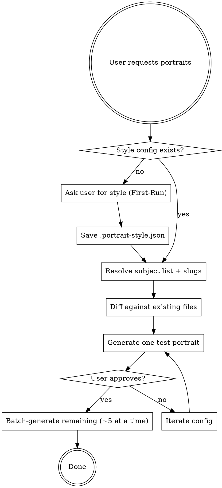

# Likeness Portraits

## Overview

Generate a cohesive set of stylized portrait illustrations of named individuals using an image-gen MCP, keyed to a per-project art direction saved in `.portrait-style.json`. Output is a directory of `kebab-case-name.jpg` files the app references by slug.

The default style — minimalist single-weight line-art stencil, one ink color on warm cream, head-and-shoulders bust, square — was validated across 76 author portraits for the spence.growth editorial dashboard and reads as literary/editorial rather than AI-generic.

## Required Tool

Uses the **nano-banana-2** MCP (`mcp__nano-banana-2__generate_image` and `mcp__nano-banana-2__edit_image`). Don't silently swap in a different generator — style consistency across a batch depends on the specific model.

## Workflow



## First-Run: Prompt for Style

On the first run in a project (no `.portrait-style.json` in the output dir), ask these as a **single grouped question** — offer the defaults explicitly so the user can say "defaults" and move on.

| Field                  | Default (spence.growth)                                                            | What to offer                                             |
| ---------------------- | ---------------------------------------------------------------------------------- | --------------------------------------------------------- |
| `line_color`           | `#1A4735` (forest green)                                                           | Any hex; should match brand primary                       |
| `background_color`     | `#FFFCF1` (warm cream)                                                             | Any hex; should match page background                     |
| `composition`          | `head-and-shoulders bust`                                                          | bust / shoulders-up / waist-up / full-body                |
| `line_style`           | `minimalist single-weight stencil, clean continuous strokes`                       | stencil / loose sketch / cross-hatched / woodcut / etched |
| `detail_level`         | `low-to-medium — recognizable likeness, interior lines only for hair/beard/fabric` | low / medium / high                                       |
| `aspect`               | `1:1 square`                                                                       | 1:1 / 3:4 / 4:5                                           |
| `attire_era`           | `period-appropriate to the subject`                                                | period-appropriate / modern / neutral                     |
| `background_treatment` | `flat, subtle paper texture acceptable`                                            | flat / soft vignette / textured paper                     |
| `output_dir`           | (infer from project — e.g. `public/portraits/`)                                    | repo-relative path                                        |
| `file_format`          | `jpg`                                                                              | jpg / png / webp                                          |

Save to `{output_dir}/.portrait-style.json`. Read it on every subsequent run so the user is never re-prompted unless they explicitly ask to change the style.

## Prompt Template

Use this structure with `mcp__nano-banana-2__generate_image`. The ordering matters — don't shuffle it.

```
A portrait illustration of {full_name} ({one-line descriptor: era, role, nationality}).

Style: {line_style}. Drawn in a single color, {line_color}, on a solid {background_color} background. {detail_level} detail — prioritize a recognizable likeness with as few lines as the subject allows. No color fills, no gradients, no shading beyond minimal parallel line work where strictly needed for form.

Composition: {composition}, subject centered, facing camera or slight 3/4 turn, calm neutral expression. {aspect} aspect ratio. {background_treatment}.

Attire: {attire_era} — clothing should help identify the era and role (toga, clerical collar, suit, sari, monk's robe, military uniform, etc.).

Likeness is critical. Match the known appearance of {full_name} — hair, facial structure, and signature features (beard, glasses, headwear, etc.).

Do NOT include: text, captions, signatures, borders, frames, watermarks, color fills, photorealism, multiple figures, or background scenery.
```

**For obscure or living subjects:** The model may not have a strong prior. Ask the user for a reference photo and use `mcp__nano-banana-2__edit_image` with `reference_images` instead of `generate_image`. Never invent a face for someone unknown — skip them and tell the user.

## Slugs

`slug = kebab-case(full_name)` with diacritics stripped.

| Name            | Slug              |
| --------------- | ----------------- |
| Marcus Aurelius | `marcus-aurelius` |
| Brené Brown     | `brene-brown`     |
| W.E.B. Du Bois  | `web-du-bois`     |
| bell hooks      | `bell-hooks`      |

Keep this deterministic so app code builds paths from names directly without a lookup table.

## Test-One-First Rule

Always generate **one portrait first**, show it to the user, and get approval before batching. Style config descriptions are approximate; output can drift (too sketchy, too dense, wrong mood). Plan for one config iteration — don't apologize for it.

After approval, batch the rest in groups of ~5. The MCP handles concurrent calls; more than 5 tends to hit rate limits.

## Skip Already-Generated

Before generating, `ls {output_dir}` and diff against the subject slug list. Only generate the gaps. Re-runs must be cheap.

## Integrating Back Into Code

If the project has a data file keying names to content (quotes, cards, team bios), add a filter that only surfaces entries whose slug has a matching file on disk. This way each new batch automatically expands what the UI shows without a manual array update.

```ts
import fs from "fs";
import path from "path";

const portraitsDir = path.join(process.cwd(), "public/portraits");
const HAS_PORTRAIT = new Set(
  fs
    .readdirSync(portraitsDir)
    .filter((f) => /\.(jpg|png|webp)$/.test(f))
    .map((f) => f.replace(/\.[^.]+$/, "")),
);

export function getDailyQuote() {
  const pool = QUOTES.filter((q) => HAS_PORTRAIT.has(slugify(q.attribution)));
  return pool.length ? pickByDay(pool) : pickByDay(QUOTES); // graceful fallback
}
```

## Example Style Config (spence.growth)

`apps/web/public/portraits/.portrait-style.json`

```json
{
  "line_color": "#1A4735",
  "background_color": "#FFFCF1",
  "composition": "head-and-shoulders bust, centered, slight 3/4 turn",
  "line_style": "minimalist single-weight stencil line art, clean continuous strokes, no cross-hatching",
  "detail_level": "low-to-medium — enough interior lines for hair texture, beard, and fabric folds; the face reads from a distance",
  "aspect": "1:1",
  "attire_era": "period-appropriate",
  "background_treatment": "flat, subtle paper texture acceptable",
  "output_dir": "apps/web/public/portraits",
  "file_format": "jpg"
}
```

This is the validated reference style — 76 historical/intellectual figures rendered consistently. Diverge from it deliberately.

## Common Mistakes

| Mistake                                               | Fix                                                                   |
| ----------------------------------------------------- | --------------------------------------------------------------------- |
| Batching 50 portraits before showing one              | Test-one-first. Style drift is real.                                  |
| Different style per subject ("make Einstein playful") | Consistency is the point. Mood comes from the face, not the style.    |
| Hardcoding hex in the prompt                          | Always read from `.portrait-style.json`.                              |
| Trimming the negative list from the prompt            | It's load-bearing. Keep it.                                           |
| Inventing a face for obscure subjects                 | Ask for a reference photo or skip the subject.                        |
| Using `generate_image` for living people              | Prefer `edit_image` with a user-supplied reference for anyone living. |
| Re-generating files that already exist                | Diff against output dir first.                                        |
